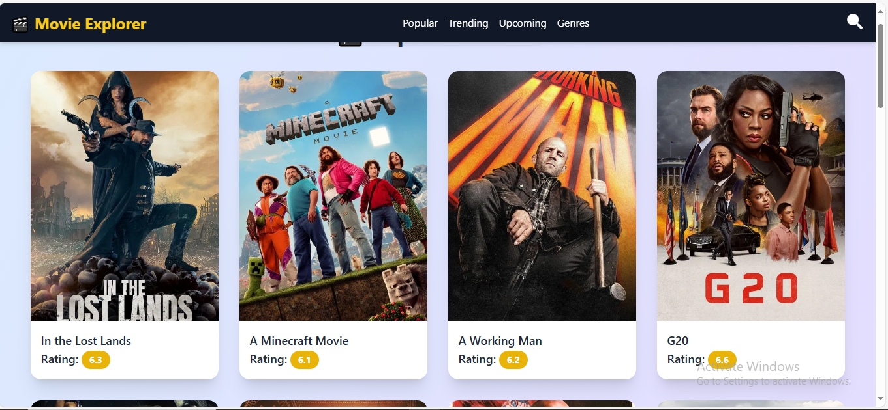

# 🎬 Movie Explorer App

A fully responsive and visually appealing Movie App built using **React.js**, **Tailwind CSS**, and the **TMDB API**. This app allows users to browse trending movies, search for their favorite titles, and view detailed movie information — all in a sleek, modern UI.

## 🚀 Features

- 🔍 Search movies by title in real-time
- 🌟 View trending and popular movies
- 🖼️ Detailed movie pages with overview, rating, release date, and poster
- 🎨 Responsive design using Tailwind CSS
- 🌐 Powered by [TMDB API](https://www.themoviedb.org/documentation/api)

## 🛠️ Tech Stack

- **Frontend:** React.js, Tailwind CSS
- **API:** The Movie Database (TMDB)
- **Icons:** Box-icons
  
## Live Demo
(https://movies-seven-ashy.vercel.app/)

## 📸 Screenshots

<!-- Add images here -->
**Home Page**

**Geners Page**

**Seacrh Page**


## 📦 Setup Instructions

1. **Clone the repository**

```bash
git clone https://github.com/your-username/movie-explorer-app.git
cd movie-explorer-app
